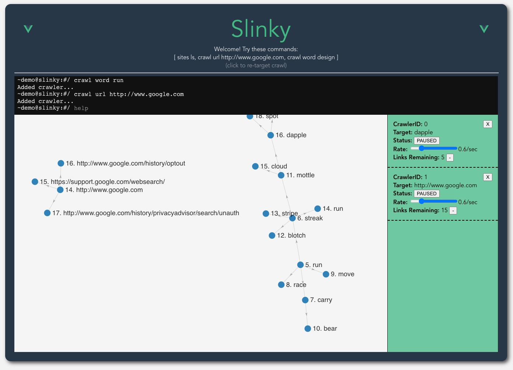

# slinky-vueclient



## Overview

Slinky is simple Vue demo for crawling a directed acyclic force-graph (DAG) of related entities.

Supports:

* **URL**: Basic url crawling through a corresponding API that scrapes hrefs.
* **WORD**: Related words through an API proxy to the DataMuse words API.

*API not yet hosted and app cannot be run locally*

## Project setup
```
npm install
```

### Compiles and hot-reloads for development
```
npm run serve
```

### Compiles and minifies for production
```
npm run build
```

### Lints and fixes files
```
npm run lint
```

### Customize configuration
See [Configuration Reference](https://cli.vuejs.org/config/).
